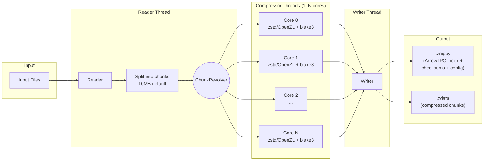
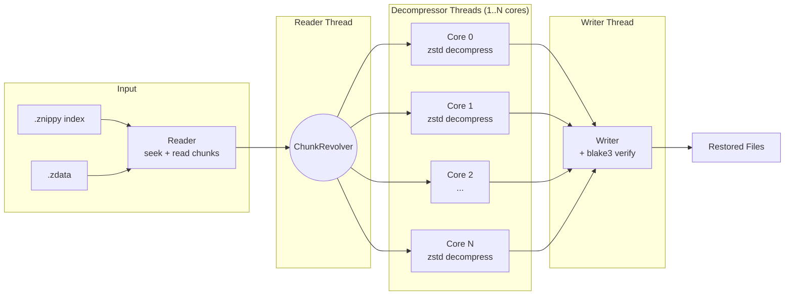

# Znippy

High-performance archive format with per-file compression, parallel processing, and random access.
Built on **Apache Arrow IPC** + **zstd** (migrating to **OpenZL**).

## Benchmarks (32-core, zstd level 19)

| Test | In | Out | Ratio | Compress | Decompress |
|------|-----|-----|-------|----------|------------|
| text 500MB | 500 MB | 0.09 MB | 5404x | 1,597 MB/s | 3,086 MB/s |
| single file 2GB | 2,048 MB | 0.35 MB | 5868x | 3,984 MB/s | 3,089 MB/s |
| 100k small files | 977 MB | 12.5 MB | 77.9x | 3,140 MB/s | 863 MB/s |
| rust crates (53k files) | 1,298 MB | 174 MB | 7.5x | 41 MB/s | 1,417 MB/s |

## Architecture



## Decompression Pipeline



## Features

- **Parallel compression**: fan-out to all cores via ChunkRevolver
- **Blake3 checksums**: per-group integrity verification (machine-independent)
- **Arrow IPC index**: queryable by DuckDB, Polars, DataFusion
- **Skip detection**: already-compressed files (.zip, .gz, .png, etc.) stored as-is
- **Random access**: seek directly to any file's chunks via index

## Usage

```bash
# Compress a directory
znippy compress --input ./mydata --output archive.znippy

# Decompress
znippy decompress --input archive.znippy --output ./restored

# Verify integrity (no file writes)
znippy verify --input archive.znippy

# List contents
znippy list --input archive.znippy
```

## Roadmap

- **v0.2.5** (current, tagged `v0.2.5-zstd`): zstd + Arrow IPC, 2-file format
- **v0.3**: Single-file format (Arrow IPC with inline binary column per chunk)
- **v0.4**: OpenZL backend — per-file-type specialized compression

## Fan arts


